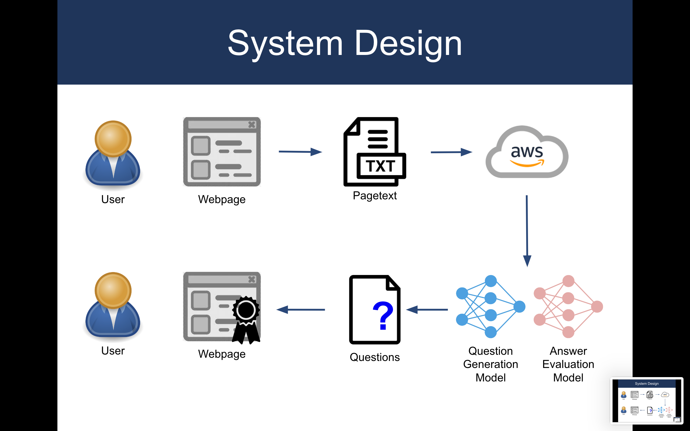
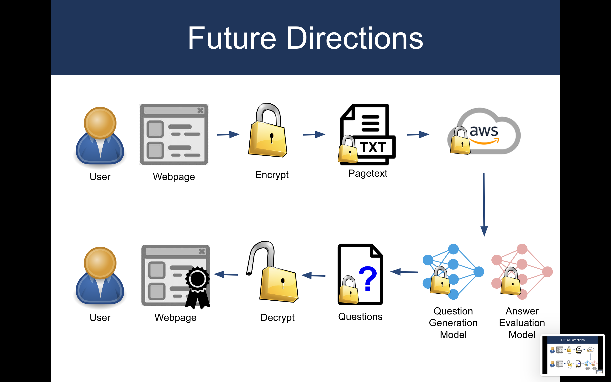

# Questioner: A Question-Generating Browser Extension to Aid in Reading Comprehension of Online Text

Mykyta Solonko, James Zhao, Rajat Doshi

## Overview
Please also check out our [video presentation!](https://www.youtube.com/watch?v=2x2a4Jw1tvI)

Attention spans and working memory have gotten shorter and shorter in schoolchildren over the past decade due to the rise in internet usage. Making things worse, much of education has shifted online with the rise of internet based textual learning. This results in a new problem: teachers may assign web pages to read and study, but student reading comprehension of those web pages is poor due to limited attention span. 

Our solution, Questioner, attempts to address this problem. Questioner engages students with the online material via an automated question-answering system. Research has show that this active mode of learning has been proven more effective than just passively reading browser text. This “Socratic method” of learning engages and stimulates students and readers, keeping their engagement so that they do not easily navigate away to other pages. 

Questioner can be used by educators to accurately and painlessly measure student comprehension of online web pages. It does this by sparing the teacher the manual labor of hand-designing reading comprehension quizzes for a particular web page. Leveraging the power of natural language processing (NLP) and cloud computing, Questioner automatically and programmatically generates questions to test the student’s understanding of the material. Once the student has responded, Questioner uses NLP algorithms to accurately assess the correctness of the student’s response. Once the student answers all questions, a “certificate of completion” is generated that can be used by the educator to quickly and conveniently assess a student’s understanding of a particular webpage. 

## System Design

Our system is designed as a browser extension. The web extension parses the webpage and sends the webpage to our cloud services on AWS, where NLP models analyze the text and generate relevant questions. These questions are then sent back to the user for them to answer as they read the article. The user’s responses are then sent back to our cloud services for assessment and evaluation. Once the user accurately completes all of the questions, a “certificate key” is generated for the student to submit to the teacher. This is also uploaded to our database. Teachers can then verify these keys against our online database to be certain that the student has understood the material.

## Downloading and Running

Questioner's backend runs on AWS and requires custom layers to be installed in the AWS environment. It also requires a HuggingFace API key, which you can get by creating a free account. To setup and run our extension:
- Clone our repository to your local machine: `git clone git@github.com:msolonko/Questioner.git`
- Take the files in the Extension folder and upload to Chrome extensions page
- Setup the HuggingFace API key and replace it in the code
- Setup a AWS lambda function, change the endpoint URL to your endpoint, import custom layers, and take the files in the AWS folder and put them into the Lambda function
- Run the extension locally from your browser. You should now be able to generate questions for a particular webpage! 

## Future Directions 

One important issue today is the privacy of user data. Questioner can be made to completely respect user privacy while preserving all of its functionality. To preserve privacy, the webpage and user text shall be encrypted on the client side with a client generated private key before sending it to our cloud service. Without knowledge of the user’s private key, nobody else can decrypt the user text, nor the webpage the user is viewing.

Once the encrypted text is sent to our service (running on AWS), our models will operate directly on the encrypted text without decrypting it. This is possible through recent technical advances in homomorphic encryption in machine learning, which enables machine learning models to act directly on encrypted text without any loss in accuracy. The output of the machine learning models is sent back to the user client, where the text will then be decrypted on the client side and displayed to the user.

